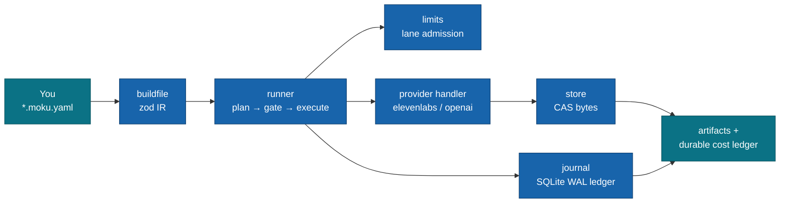
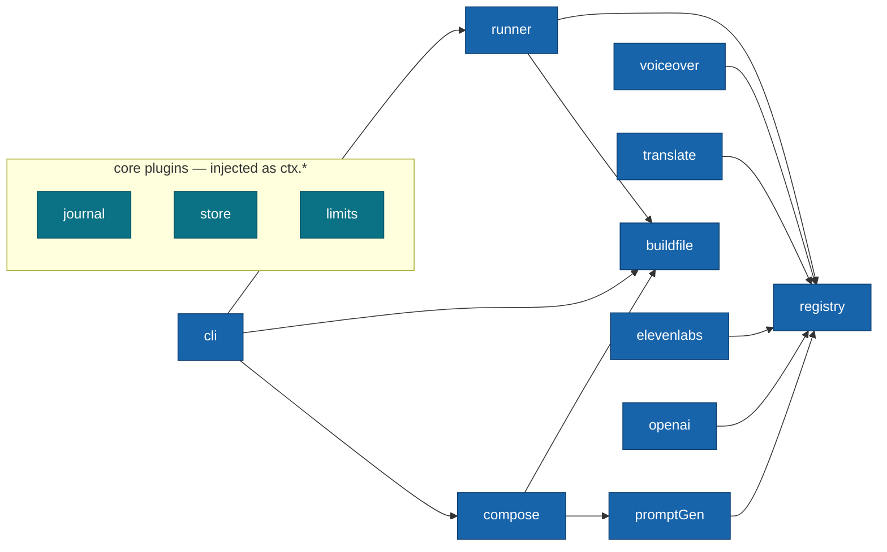

# @moku-labs/ai

**A build system for AI-generated assets — declarative build files in, artifacts out.**

Any task × any provider × any account pool. You declare *what* should exist in a
`*.moku.yaml` build file; the runner drives whichever provider implements the task,
gates every dollar through an atomic budget check, and journals every state transition
to crash-durable SQLite. It is not an SDK wrapper and not a general job queue — it is a
build system: resumable always, incremental by default, never loses a byte of progress.
Built on [`@moku-labs/core`](https://github.com/moku-labs/core) (a Layer-2 framework in
the three-layer Moku model).

<br/>

[](https://www.npmjs.com/package/@moku-labs/ai)
[](#requirements)
[](#requirements)
[](#how-it-works)
[](./LICENSE)

<br/>

[Install](#install) · [Quick start](#quick-start) · [Plugins](#plugins) · [CLI](#the-moku-cli) · [Configuration](#configuration) · [Events](#events) · [Docs](#docs)

---

## Why @moku-labs/ai

- **`kill -9` is a supported workflow.** Every run/item/attempt transition is a
  committed SQLite write under WAL + `synchronous=FULL` inside `BEGIN IMMEDIATE` — a
  crash at any instant loses at most mid-flight work, never recorded progress.
  `moku run` again and the run resumes where it stopped.
- **Budget-gated by construction.** One atomic transaction checks projected spend
  (`done actuals + dispatching estimates + this item`) against `--max-cost` *and*
  dedups the item before anything is billed. The guarantee is
  `spend ≤ done items + items dispatching at kill`.
- **Any task × any provider.** Task plugins own capability contracts
  (`voiceover`, `translate`, `prompt-gen`, `image`, `video`); provider plugins
  (`elevenlabs`, `openai`, `codex`, `fal`) register handlers with a dumb registry. Neither imports the other — consumer apps
  add both without touching the framework.
- **Incremental by default.** Every item has an artifact key (`sha256` of task,
  provider, input, params, and the keys of everything it references). A done artifact
  is reused by any later run for $0, so re-running a build re-bills nothing that is
  already done — and changing one keyframe re-renders only that shot.
- **Long provider jobs survive crashes.** Video handlers `submit` and `poll`; the
  provider job id is journaled before anything waits on it, so a crash, Ctrl-C or
  timeout is resumed by polling the same job, never by paying for it twice.
- **A build system, not an SDK wrapper.** No streaming chat helpers, no agent loops —
  build files in, integrity-verified artifacts and a durable cost ledger out.

## Install

```sh
bun add @moku-labs/ai
```

> [!NOTE]
> **Status: `0.x` — early.** Runtime dependencies (`@moku-labs/core`,
> `@moku-labs/common`, `better-sqlite3`, `openai`, `yaml`, `zod`) install with the
> package. On Bun the journal uses the built-in `bun:sqlite` driver instead of
> `better-sqlite3`. Providers read API keys from the environment at request time —
> export `ELEVENLABS_API_KEY` / `OPENAI_API_KEY` / `FAL_KEY`, or put them in a `.env.local`
> file in the working directory (the shell wins over the file), before executing (estimates and
> validation never need a key).

## Quick start

Declare a build file (or generate one: `moku compose "narrate and translate a greeting"`):

```yaml
# hello.moku.yaml
version: 1
name: hello
items:
  - task: voiceover
    input:
      text: "Hello, world!"
      voice: "21m00Tcm4TlvDq8ikWAM"
  - task: translate
    provider: openai
    input:
      text: "Hello, world!"
      targetLang: es
```

Run it programmatically:

```ts
import { createApp } from "@moku-labs/ai";

const app = createApp({});
await app.start();

// Estimate first, then run with a budget ceiling.
const { totalUsd } = await app.runner.estimate({ files: "hello.moku.yaml" });
const result = await app.runner.run({ files: "hello.moku.yaml", maxCostUsd: totalUsd * 1.2 });

console.log(result.status, result.totals); // "done", { done: 2, spendUsd: ..., ... }
await app.stop();
```

Or from the shell — the package ships the `moku` bin:

```sh
moku new hello        # scaffold hello.moku.yaml + its editor JSON Schema
moku validate         # compile every matched build file through the zod IR
moku estimate         # per-task/provider cost breakdown, no key needed
moku run --max-cost 5 # execute; Ctrl-C is a clean pause, `moku run` resumes
```

## How it works



Every item of every build file moves through one uniform pipeline: **plan** (compile,
resolve provider, compute planning key, insert as `queued`) → **admit**
(`limits.acquire("{task}/{provider}/default")`) → **gate** (atomic budget + dedup +
`queued → dispatching` in one transaction) → **execute** (registry-resolved handler) →
**persist** (`store.put` the bytes, *then* `journal.commitDone` the metadata) →
**report**. Retryable failures (5xx / 429 / timeout / network) re-queue with jittered
exponential backoff; other 4xx is terminal `failed`; content policy is terminal
`flagged`, never re-queued.

### The journal is the contract

The journal holds **metadata only** — statuses, costs, hashes, error classes; the store
holds the bytes those hashes name. An artifact exists when both halves do, bytes first.
That split is the redaction boundary (prompts and payloads are structurally impossible
to journal) and the durability guarantee in one design: never lose a byte, never bill
one twice.

## Plugins

Three core plugins are injected on every plugin's `ctx` (plus `ctx.log` / `ctx.env`
inherited from [`@moku-labs/common`](https://github.com/moku-labs/common)); ten regular
plugins mount their APIs on the app by name (`app.runner`, `app.cli`, …).

| Plugin | Tier | Kind | Responsibility |
|---|---|---|---|
| [`journal`](./src/plugins/journal/README.md) | Complex | core (`ctx.journal`) | SQLite WAL ledger — runs/items/attempts state machine, the atomic budget + dedup gate, crash durability. |
| [`store`](./src/plugins/store/README.md) | Standard | core (`ctx.store`) | Content-addressed artifact store — fsync-durable writes, integrity-verified reads, gc. |
| [`limits`](./src/plugins/limits/README.md) | Standard | core (`ctx.limits`) | Per-lane token bucket + concurrency gate + circuit breaker for all provider traffic. |
| [`registry`](./src/plugins/registry/README.md) | Nano | regular (`app.registry`) | The task → provider → handler map that keeps tasks and providers decoupled. |
| [`buildfile`](./src/plugins/buildfile/README.md) | Standard | regular (`app.buildfile`) | YAML / `defineBuild()` front-end — one zod schema, `BuildSpec` IR, JSON Schema, starter template. |
| [`runner`](./src/plugins/runner/README.md) | Complex | regular (`app.runner`) | The durable orchestrator — `run`/`resume`/`estimate`/`status`/`events()`; owns all bus events. |
| [`voiceover`](./src/plugins/voiceover/README.md) | Standard | regular (`app.voiceover`) | Owns the `"voiceover"` task contract + one-off `generate`/`estimate`/`providers` facade. |
| [`translate`](./src/plugins/translate/README.md) | Standard | regular (`app.translate`) | Owns the `"translate"` task contract + one-off facade. |
| [`promptGen`](./src/plugins/promptGen/README.md) | Standard | regular (`app.promptGen`) | Owns the `"prompt-gen"` task contract + one-off facade (backs `compose`). |
| [`elevenlabs`](./src/plugins/elevenlabs/README.md) | Complex | regular (`app.elevenlabs`) | ElevenLabs provider — registers `("voiceover", "elevenlabs")`; price table, retry-taxonomy errors. |
| [`openai`](./src/plugins/openai/README.md) | Complex | regular (`app.openai`) | OpenAI provider — registers voiceover, translate, and prompt-gen handlers via the official SDK. |
| [`compose`](./src/plugins/compose/README.md) | Standard | regular (`app.compose`) | Natural language → validated build file, with an LLM repair loop that can never emit an invalid spec. |
| [`image`](./src/plugins/image/README.md) | Standard | regular (`app.image`) | Owns the `"image"` task contract + one-off facade. |
| [`video`](./src/plugins/video/README.md) | Standard | regular (`app.video`) | Owns the `"video"` task contract (`execute` or `submit` + `poll`) + one-off facade. |
| [`codex`](./src/plugins/codex/README.md) | Standard | regular (`app.codex`) | Image provider over the local Codex CLI (`codex exec`), plan-billed. |
| [`fal`](./src/plugins/fal/README.md) | Complex | regular (`app.fal`) | Video provider over the fal queue API — Seedance 2.5 and 2.0 (Mini), MiniMax H3 and H3 Max, Kling 3, Wan 3.0, Veo 3.1 Fast, Vidu Q3; image and audio refs; per-second and reference-token prices. |
| [`cli`](./src/plugins/cli/README.md) | Complex | regular (`app.cli`) | The `moku` command surface — seven commands, branded rendering, a ratified exit-code contract. |

## The `moku` CLI

The package `bin` (`"moku"`) is a plain Layer-3 consumer:
`createApp({})` → `start()` → `app.cli.dispatch(process.argv.slice(2))` → `stop()` → exit.

| Command | What it does |
|---|---|
| `moku new [name]` | Write a starter build file + its JSON Schema (editor autocomplete via modeline). |
| `moku validate [glob]` | Compile every matched build file through the zod IR; offline, no providers needed. |
| `moku estimate [glob]` | Per-task/provider cost breakdown + total — the same math the budget gate uses. |
| `moku run [glob] [--max-cost <usd>] [--dry-run] [--out <dir>]` | Execute matched build files with live progress; SIGINT drains to a clean pause. Done artifacts are exported to `<out>/<build>/<label>.<ext>` (default `out/`). |
| `moku export [runId] [--out <dir>]` | Copy a run's done artifacts (default: the newest run) to named files. |
| `moku status [runId] [--follow]` | Snapshot (or 1s-poll) a run's totals — safe from a second process. |
| `moku compose "<prompt>" [--emit build\|script] [--out <path>]` | Generate a build file from natural language. |

Exit codes (`Cli.EXIT_CODES`): `0` ok · `1` failure · `2` validation · `3` usage ·
`4` paused (SIGINT drain) · `5` budget stop.

## Usage

### Create an app and configure plugins

```ts
import { createApp } from "@moku-labs/ai";

const app = createApp({
  pluginConfigs: {
    voiceover: { defaultProvider: "elevenlabs", defaultFormat: "mp3" },
    openai: {
      apiKeyEnv: "OPENAI_API_KEY",
      models: { tts: "gpt-4o-mini-tts", chat: "gpt-4o" },
      timeoutMs: 60_000,
      priceOverrides: {}
    },
    runner: { maxAttempts: 5 }
  }
});
await app.start();
```

Plugin APIs mount on the app by plugin name: `app.runner.run(...)`,
`app.voiceover.generate(...)`, `app.buildfile.compile(...)`, `app.cli.dispatch(...)`.
Core APIs are there too: `app.limits.snapshot(lane)`.

> [!IMPORTANT]
> `createApp`'s `pluginConfigs` is typed to **regular plugins only**. The core plugins
> (`journal`, `store`, `limits`) are configured where `createCore` is called — at M0
> their framework defaults (`.moku/journal.db`, `.moku/store`, 60 rpm / 4 concurrent
> per lane) are fixed for consumer apps.

### One-off facades vs. the durable path

```ts
// One-off: direct, NOT journaled — for scripts, tests, experiments.
const speech = await app.voiceover.generate({ text: "Hi!", voice: "21m00Tcm4TlvDq8ikWAM" });
const spanish = await app.translate.generate({ text: "Hi!", targetLang: "es" });

// Durable: journaled, budget-gated, resumable — for anything worth keeping.
const result = await app.runner.run({ files: "**/*.moku.yaml", maxCostUsd: 25 });
if (result.status === "paused") await app.runner.resume({ runId: result.runId });
```

### Add your own provider (Layer 3)

```ts
import { createApp, createPlugin, registryPlugin } from "@moku-labs/ai";
import type { Voiceover } from "@moku-labs/ai";

const handler: Voiceover.VoiceoverHandler = {
  estimate: request => ({ usd: request.text.length * 0.00003 }),
  execute: async request => ({
    audio: await synthesize(request.text, request.voice),
    mimeType: "audio/mpeg",
    costUsd: 0.001
  })
};

const acmeTtsPlugin = createPlugin("acmeTts", {
  depends: [registryPlugin],
  onInit: ctx => {
    ctx.require(registryPlugin).register("voiceover", "acme", handler);
  }
});

const app = createApp({ plugins: [acmeTtsPlugin] });
```

The same shape registers a whole new *task*: pick a task key, define an
`estimate`/`execute` handler contract, register it — build files can name it
immediately (`task: my-task`), and the runner executes it through the same durable
pipeline. The runner hands every handler the item's `input` spread flat plus
`params` — exactly the task contract's request.

A handler for a long provider job exposes `submit` + `poll` instead of (or next to)
`execute`. The runner journals the returned job id before it waits, polls every
`runner.pollIntervalMs`, and after a crash or pause polls that job again instead of
re-submitting it. Throw errors with `status` or `kind: "timeout" | "network" |
"content-policy"` to have them retried or flagged; an error without a hint is a
programming error and fails the item after one attempt.

### Images, video and references

Items reference each other with `$ref` (another item's artifact, by `id`) and local
files with `$file` (relative to the build file). The runner runs references first
and hands the handler a `{ path, mimeType, hash }` file:

```yaml
version: 1
name: ep01
items:
  - id: s01.key
    task: image
    provider: codex
    input: { prompt: "patisserie counter at night, warm lamps", aspect: "9:16",
             refs: [{ $file: refs/akari.png }] }
  - id: s01.h3
    task: video
    provider: fal
    input: { model: minimax-h3, prompt: "slow push-in", image: { $ref: s01.key }, seconds: 5 }
```

`moku run ep01.moku.yaml --max-cost 10` renders the keyframe, then the clip, and
writes `out/ep01/s01.key.png` and `out/ep01/s01.h3.mp4`. The fal models and their
per-second prices are listed in the [fal README](./src/plugins/fal/README.md); a
model with no price fails the estimate instead of counting as $0.

## Configuration

All configuration is per-plugin (the global `Config` is empty by ratified decision).
Defaults below are the shipped values; see each plugin's README for full semantics.

| Plugin | Option | Type | Default |
|---|---|---|---|
| `journal` (core) | `path` | `string` | `".moku/journal.db"` |
| | `checkpointIntervalMs` | `number` | `30_000` |
| | `busyTimeoutMs` | `number` | `5000` |
| `store` (core) | `dir` | `string` | `".moku/store"` |
| | `algo` | `"sha256"` | `"sha256"` |
| `limits` (core) | `defaults` | `LaneConfig` | `{ rpm: 60, concurrency: 4, breakerThreshold: 5, breakerCooldownMs: 30_000 }` |
| | `lanes` | `Record<string, Partial<LaneConfig>>` | `{}` |
| `registry` | — | — | no config |
| `buildfile` | `defaultGlob` | `string` | `"**/*.moku.yaml"` |
| | `schemaPath` | `string` | `".moku/build.schema.json"` |
| `runner` | `maxAttempts` | `number` | `3` |
| | `retryBaseMs` | `number` | `1000` |
| | `eventBufferSize` | `number` | `10_000` |
| | `pollIntervalMs` | `number` | `5000` |
| | `jobTimeoutMs` | `number` | `1_800_000` |
| | `maxActiveRuns` | `number` | `1` |
| `voiceover` | `defaultProvider` | `string` | `"elevenlabs"` |
| | `defaultFormat` | `"mp3" \| "wav" \| "ogg"` | `"mp3"` |
| `translate` | `defaultProvider` | `string` | `"openai"` |
| `promptGen` | `defaultProvider` | `string` | `"openai"` |
| `elevenlabs` | `apiKeyEnv` | `string` | `"ELEVENLABS_API_KEY"` |
| | `baseUrl` | `string` | `"https://api.elevenlabs.io"` |
| | `defaultModel` | `string` | `"eleven_multilingual_v2"` |
| | `timeoutMs` | `number` | `60_000` |
| | `priceOverrides` | `Record<string, number>` | `{}` |
| `openai` | `apiKeyEnv` | `string` | `"OPENAI_API_KEY"` |
| | `baseUrl` | `string?` | `undefined` (SDK default) |
| | `models` | `{ tts: string; chat: string }` | `{ tts: "gpt-4o-mini-tts", chat: "gpt-4o-mini" }` |
| | `timeoutMs` | `number` | `60_000` |
| | `priceOverrides` | `Record<string, { inputPerM?; outputPerM?; ttsPerMChars? }>` | `{}` |
| `image` | `defaultProvider` | `string` | `"codex"` |
| `video` | `defaultProvider` | `string` | `"fal"` |
| | `pollIntervalMs` | `number` | `5000` |
| `codex` | `bin` | `string` | `"codex"` |
| | `model` | `string` | `"gpt-6-astra"` |
| | `reasoningEffort` | `string` | `"low"` |
| | `timeoutMs` | `number` | `600_000` |
| | `workDir` | `string` | `".moku/tmp"` |
| | `priceOverrides` | `Record<string, number>` | `{}` |
| `fal` | `apiKeyEnv` | `string` | `"FAL_KEY"` |
| | `queueUrl` | `string` | `"https://queue.fal.run"` |
| | `upload` | `"storage" \| "data-uri"` | `"storage"` |
| | `timeoutMs` | `number` | `60_000` |
| | `priceOverrides` | `Record<string, number>` | `{}` |
| `compose` | `provider` | `string` | `"openai"` |
| | `maxRepairAttempts` | `number` | `2` |
| `cli` | `plain` | `boolean` | `false` (auto-true when !TTY or `NO_COLOR`) |

## Events

The runner is the only bus-event declarer at M0. Per-item detail deliberately **never**
touches the plugin bus (a million items would serialize on sequential-await hook
dispatch) — it flows through `app.runner.events()`, a backpressured `AsyncIterable`.

**Bus events** — subscribe from a plugin that declares `depends: [runnerPlugin]` and a
`hooks` map:

| Event | Payload | When |
|---|---|---|
| `run:progress` | `{ runId, total, done, failed, flagged, spendUsd }` | Coalesced progress, ≤1 per 500ms |
| `run:done` | `{ runId, totals: RunTotals }` | Run completed |
| `run:failed` | `{ runId, error: string }` | Unrecoverable run error |
| `run:budget-stop` | `{ runId, spendUsd, maxCostUsd }` | Budget ceiling reached, run drained |
| `run:paused` | `{ runId, drained }` | Clean pause (abort) completed |

```ts
import { createApp, createPlugin, runnerPlugin } from "@moku-labs/ai";

const reporterPlugin = createPlugin("reporter", {
  depends: [runnerPlugin],
  hooks: ctx => ({
    "run:progress": payload => ctx.log.info("progress", payload),
    "run:done": payload => ctx.log.info("run complete", { runId: payload.runId })
  })
});

const app = createApp({ plugins: [reporterPlugin] });
```

**Stream records** (`app.runner.events()`, discriminated on `type`): `item:queued`,
`item:dispatching`, `item:done`, `item:retry`, `item:failed`, `item:flagged`,
`overflow`, `progress`, and a `terminal` record that is always delivered last.
Every record carries its `runId`.

### Several runs at once

`runner.maxActiveRuns` (default `1`) lets one process drive several `run()` /
`resume()` calls at the same time. Above the cap, `run()` throws
`[ai] A run is already active`. Each run keeps its own abort signal, budget, totals
and status. Limits lanes stay global, so two runs share one lane's concurrency and
rpm. An item with the same artifact key in two runs reaches the provider once: the
second run waits and records the first one's result at cost 0.

```ts
const app = createApp({ pluginConfigs: { runner: { maxActiveRuns: 10 } } });

await app.runner.run(
  { files: "ep01/*.moku.yaml" },
  { onStart: runId => follow(app.runner.events({ runId })) }
);
```

`events({ runId })` follows one run. `events()` follows every run until none is active.

## Architecture



Registration order in `src/index.ts` puts every plugin after its dependencies:
`registry → buildfile → runner → voiceover → translate → promptGen → elevenlabs →
openai → compose → cli`. Provider plugins register their handlers in `onInit`, so by
the time `app.start()` resolves, every task facade sees its providers — and the
*first*-registered provider is each task's implicit default.

The factory chain is the standard three-layer Moku shape: `src/config.ts` builds
`coreConfig` (`createCoreConfig("ai", …)` with the five core plugins), `src/index.ts`
assembles the framework (`createCore`) and exports `createApp` + `createPlugin` for
Layer-3 consumers.

## Development

- Plugins live in `src/plugins/<name>/` — `index.ts` (definition), `types.ts`,
  `api.ts`, plus colocated `__tests__/unit/` and `__tests__/integration/`. Root
  `tests/` is for framework-level integration only.
- 812 tests across unit + integration projects, 90% coverage threshold.
- Follow the family conventions: branded CLI output via `@moku-labs/common/cli`,
  `ctx.log` (never `console.*`), `ctx.env` (never `process.env`).

## Scripts

```sh
bun run build              # build with tsdown
bun run validate           # publint + arethetypeswrong (node16 profile)
bun run lint               # biome check + eslint
bun run lint:fix           # auto-fix lint issues
bun run format             # format with biome
bun run test               # all tests (vitest)
bun run test:unit          # unit project only
bun run test:integration   # integration project only
bun run test:coverage      # unit + integration with coverage
```

## Requirements

- **Node `>= 24`** and **Bun `>= 1.3.14`** — use `bun` exclusively (never npm/yarn/pnpm).
- **TypeScript** in strict mode, with `exactOptionalPropertyTypes` and `noUncheckedIndexedAccess`.
- **[`@moku-labs/core`](https://github.com/moku-labs/core)** — the micro-kernel this framework composes on.
- **[`@moku-labs/common`](https://github.com/moku-labs/common)** — supplies the `log`/`env` core plugins and the branded CLI renderer.

## Docs

- Per-plugin references (configuration, full API, integration notes):
  [journal](./src/plugins/journal/README.md) ·
  [store](./src/plugins/store/README.md) ·
  [limits](./src/plugins/limits/README.md) ·
  [registry](./src/plugins/registry/README.md) ·
  [buildfile](./src/plugins/buildfile/README.md) ·
  [runner](./src/plugins/runner/README.md) ·
  [voiceover](./src/plugins/voiceover/README.md) ·
  [translate](./src/plugins/translate/README.md) ·
  [promptGen](./src/plugins/promptGen/README.md) ·
  [elevenlabs](./src/plugins/elevenlabs/README.md) ·
  [openai](./src/plugins/openai/README.md) ·
  [compose](./src/plugins/compose/README.md) ·
  [cli](./src/plugins/cli/README.md)
- LLM-oriented docs: [`llms.txt`](./llms.txt) (concise) and [`llms-full.txt`](./llms-full.txt) (complete type-level reference).
- [Moku Core specification](https://github.com/moku-labs/core/tree/main/specification).

## License

[MIT](./LICENSE) © [moku-labs](https://github.com/moku-labs)
